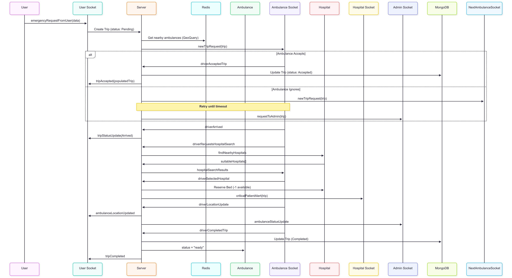

# MedSwift - Real-Time Ambulance Tracking & Emergency Dispatch System

MedSwift is a **real-time emergency medical transport platform** designed for rapid ambulance dispatch, live tracking, and efficient hospital coordination.  
It’s built for **speed, scalability, and reliability** — ensuring that emergency response is as fast and organized as possible.

---

## 📌 Core System Overview


**Description:**  
This diagram outlines the **overall architecture** of MedSwift, including the flow of data between users, ambulances, hospitals, and the admin panel.  
It highlights the integration of **real-time sockets**, **Redis caching** and **MongoDB persistence** for location services.

---

## 🚑 Trip Creation & Ambulance Dispatch


**Description:**  
When a user requests an ambulance:  
1. The server creates a **pending trip** and searches for **nearby ambulances** in Redis.  
2. Each ambulance is notified via Socket.IO in sequence until one **accepts**.  
3. If no driver accepts, the **admin** is alerted for manual dispatch.  
4. Once accepted, the trip status changes to **Accepted**, and live tracking begins.

---

## 🏥 Hospital Search & Selection


**Description:**  
During the trip, the ambulance driver can:  
1. Request a **nearby hospital search** (optionally filtered by blood group or capacity).  
2. The server queries Redis/MongoDB for **available hospitals** and returns results.  
3. The driver selects a hospital → the system reserves a bed and sends a **critical patient alert** to that hospital.  
4. Hospital staff prepare in advance for patient arrival.

---

## 📍 Live Location & Trip Completion


**Description:**  
1. The ambulance app sends **live GPS updates** every few seconds via Socket.IO.  
2. The server broadcasts these updates to both the **user** and the **admin panel**.  
3. Upon trip completion, the driver marks the trip as **Completed**, and MongoDB is updated.  
4. Final notifications are sent to all stakeholders.

---

## ✨ Features
- 🚨 **Real-time ambulance dispatch** with failover to admin in case of no driver acceptance  
- 📍 **Live GPS tracking** for both users and admins  
- 🏥 **Hospital integration** for critical alerts & bed reservations  
- ⚡ **Optimized Redis queries** for high-speed location searches  
- 🔐 Secure **JWT authentication** for all API endpoints  
- 📡 Built on **Socket.IO** for instant updates

---

## 🛠 Tech Stack

| Layer              | Technology |
|--------------------|------------|
| Backend Framework  | Node.js + Express.js |
| Database           | MongoDB (Mongoose) |
| Real-Time Engine   | Socket.IO |
| Cache & Pub/Sub    | Redis |
| Authentication     | JWT |
| Deployment Ready   | Docker & PM2 |

---

## 🚧 Development Status
This project is **actively under development**.  
The real-time dispatch system, live location tracking, and hospital coordination flows are fully functional.  
Next phases include:
- 🚀 **Performance tuning** for handling 50+ concurrent dispatch requests  
- 📊 **Analytics & trip history** for admins  
- 🔒 **Advanced security features** (role-based access control, IP rate-limiting)  

---

## 📂 Project Setup

**Clone, Install & Run**
```bash
git clone https://github.com/rajashekarpatha07/medswift.git
cd medswift
pnpm install
pnpm run dev
```

