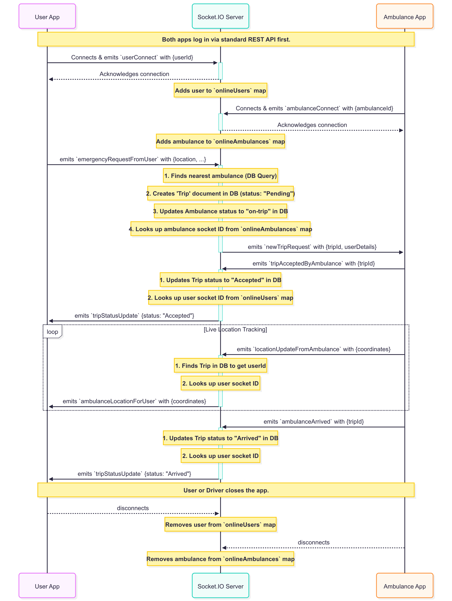

# MedSwift - Real-Time Ambulance Tracking & Emergency Dispatch System

## System Architecture
.png)
## Dispatch Flow

## SocketFLow

**Status:** 🚧 Under Development

---

## About

MedSwift is a real-time ambulance tracking and emergency dispatch system designed to help users book emergency rides, track ambulances live, and enable efficient dispatch through an admin panel.

### Features (Planned)
- User emergency ride booking with real-time ambulance tracking
- Ambulance driver app for live location sharing and request handling
- Admin panel to monitor and dispatch ambulances
- Secure authentication with JWT
- Real-time communication via Socket.IO or MQTT
- Google Maps API integration for location services
- Redis caching for performance optimization

---

## Tech Stack

- Node.js
- Express.js
- MongoDB (Mongoose)
- JWT for authentication
- Socket.IO / MQTT for real-time data
- Google Maps API
- Redis

---

## Development Status

This project is actively under development.  
I commit daily updates and changes to this repository to steadily build out the full system.

---

## Getting Started

*Instructions coming soon.*

---

## Contributions

Contributions are welcome but please reach out before submitting major changes.

---

*Made with focus on scalable, secure, and efficient backend systems.*

---

*Last updated: [05/06/2025]*
